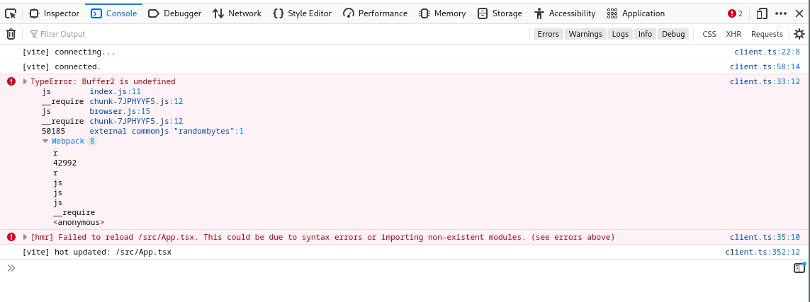

# Vite & Swagger UI build issues - minimal example

Related discussion in PR on Swagger UI repo: https://github.com/swagger-api/swagger-ui/pull/7898

Steps to get here:

1. `npm create vite@latest swagger-ui-on-vite`
2. Pick "react" and "react-ts"
3. For a dev build, run `npm run dev`
4. Cleanup default main.tsx and css
5. `npm install --save swagger-ui-react`
6. Import and use the `SwaggerUI` component
7. Observe errors when opening the app:

